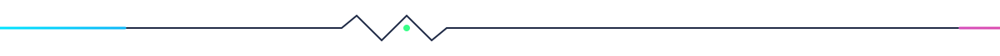
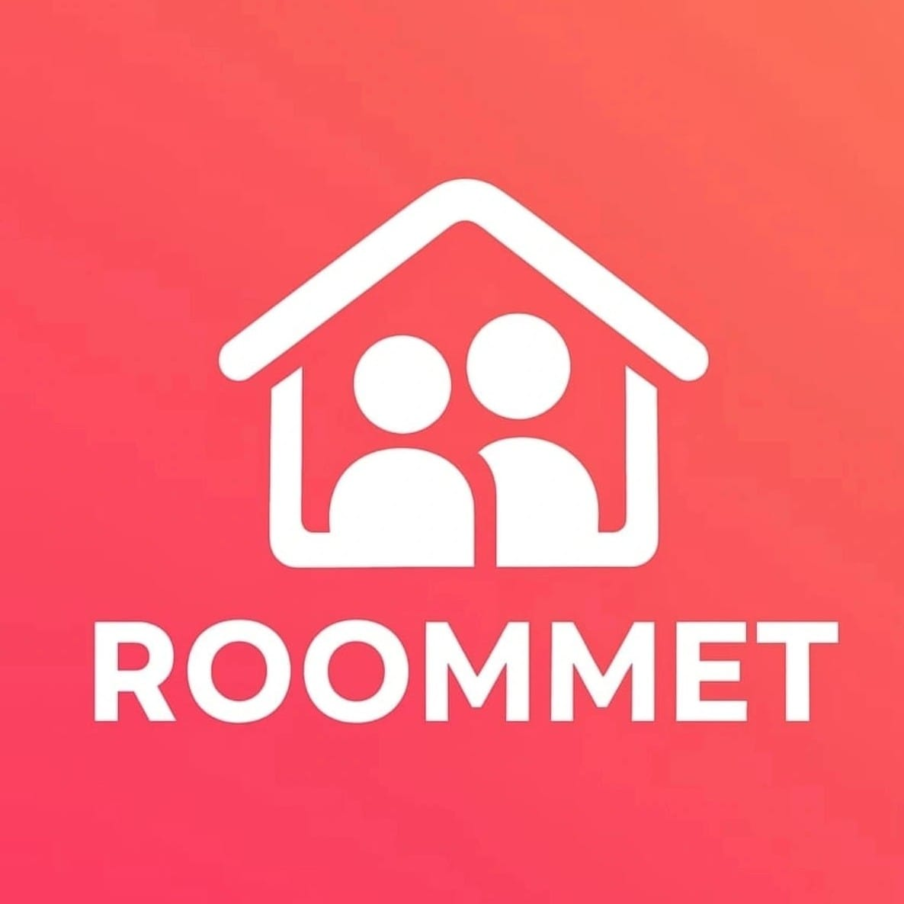
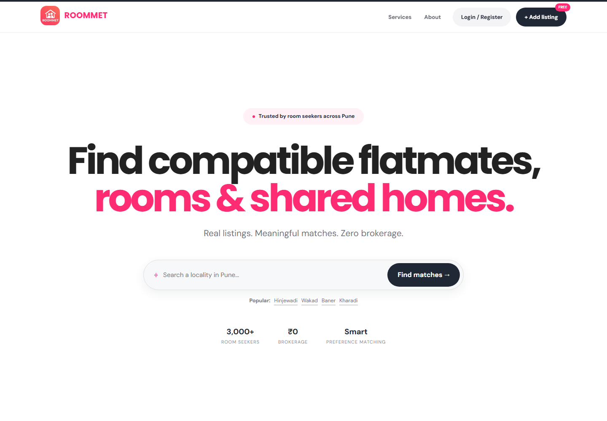
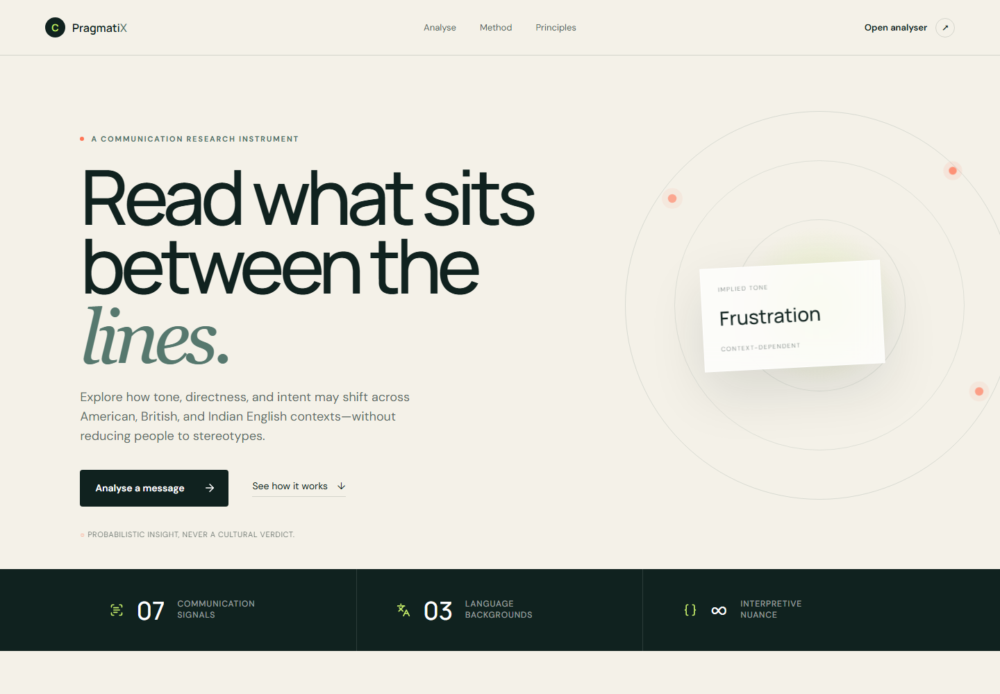
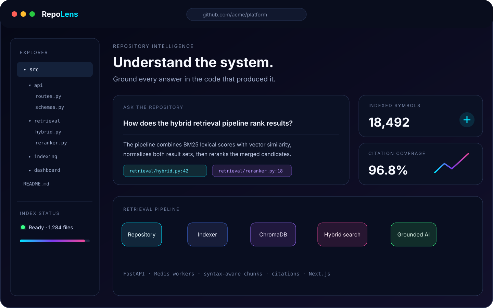
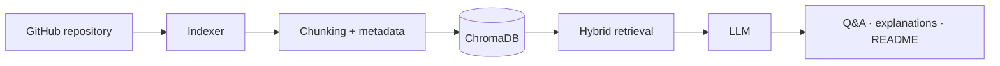
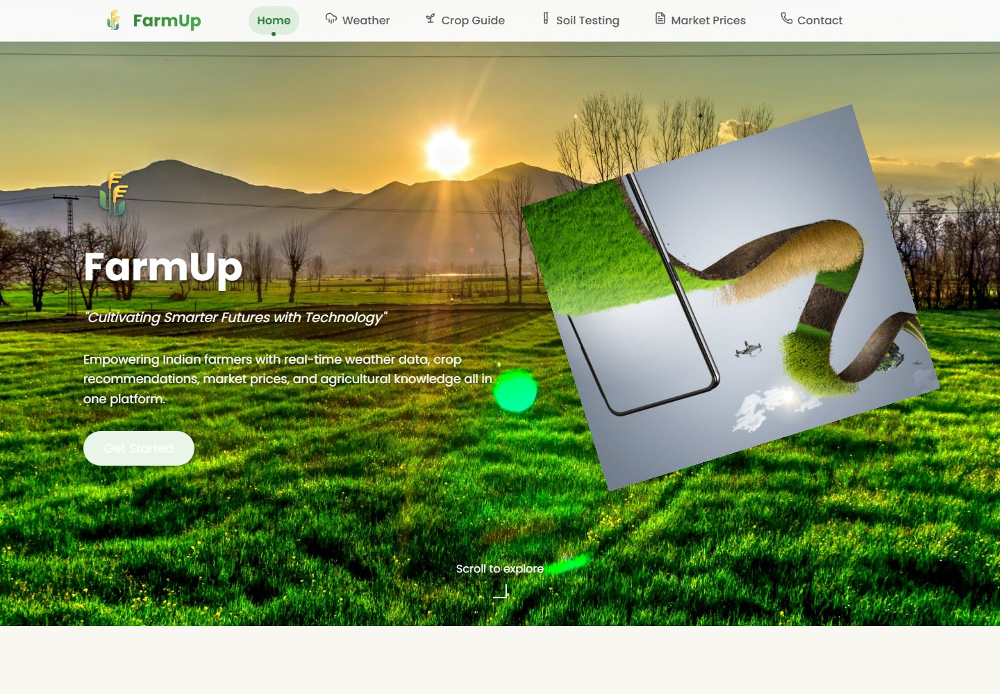
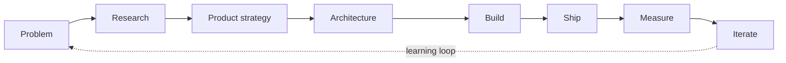

<div align="center">



<br />


<br />

<a href="https://linkedin.com/in/atharva-lole-136089282" title="LinkedIn"></a>&nbsp;&nbsp;
<a href="https://instagram.com/ath_2207_/" title="Instagram"></a>&nbsp;&nbsp;
<a href="https://github.com/AtharvaLole" title="GitHub"></a>&nbsp;&nbsp;
<a href="mailto:atharvalole12@gmail.com" title="Email"></a>

<br />


</div>

<br />

> I work across product strategy, interface design, architecture, and engineering—turning ambiguous ideas into software people can actually use.

```ts
const atharva = {
  role: ["Product Developer", "Full Stack Engineer", "Product Thinker"],
  building: ["AI-powered products", "developer tools", "data products", "human-centered software"],
  exploring: ["Machine Learning", "Data Visualization", "Product Strategy", "RAG"],
  philosophy: "Build the right thing. Build it well. Ship it. Measure it."
};
```



# Selected Builds

## 01 · RoomMet

<p align="center">
  
</p>

### Housing discovery built around compatibility—not classified-ad clutter.

RoomMet is my flagship product: a preference-led platform that helps people discover rooms, compatible flatmates, and shared communities without brokerage friction. I shaped the product experience from architecture and responsive interface design through shipping, feedback, and iteration.

<a href="https://roommet.com"></a>



**What I built**

- Product architecture for housing and community discovery
- Preference-driven matching, direct listings, and privacy-conscious conversations
- Responsive frontend system designed for continuous product iteration
- A zero-brokerage journey from locality search to compatible shortlist

`Next.js` · `React` · `JavaScript` · `Firebase` · `Figma` · `Product Design`


## 02 · PragmatiX

### Cross-cultural communication intelligence that explains the space between words and intent.

PragmatiX is a context-aware NLP platform for examining how the same message may be interpreted across American, British, and Indian English. It turns probabilistic language signals into clear, explainable analysis—without presenting cultural stereotypes as verdicts.

<a href="https://pragmati-x.vercel.app/"></a>
<a href="https://github.com/AtharvaLole/PragmatiX"></a>



**Engineering highlights**

- Politeness, aggression, directness, sarcasm, implied sentiment, and intent analysis
- Conversation-aware sarcasm detection and interpretation-gap scoring
- Neutral rewriting with explainable NLP output
- Versioned FastAPI endpoints, PostgreSQL persistence, and automated tests

`FastAPI` · `Python` · `NLP` · `PostgreSQL` · `Pytest`


## 03 · AI-Powered Repo Analyzer

### A developer tool for turning an unfamiliar repository into grounded, navigable context.

The analyzer indexes source code, combines semantic and lexical retrieval, and answers repository questions with citations. It also explains code, generates documentation, and gives developers a focused Next.js exploration surface while heavier indexing work runs in the background.

<a href="https://github.com/AtharvaLole/repo-analyzer-codex2026"></a>



**Engineering highlights**

- FastAPI API with Redis-backed background indexing
- Syntax-aware code chunking, metadata, and ChromaDB storage
- Hybrid retrieval and citation-grounded RAG answers
- Repository Q&A, code explanation, README generation, and a Next.js dashboard

`FastAPI` · `Redis` · `ChromaDB` · `RAG` · `Next.js`




## 04 · FarmUp

### Agricultural intelligence that brings fragmented field signals into one advisory experience.

FarmUp combines live weather, soil parameters, crop knowledge, and rule-driven recommendations to help farmers make better-informed day-to-day decisions through one approachable interface.

<a href="https://farmmup.netlify.app/"></a>
<a href="https://github.com/AtharvaLole/FarmUp"></a>



**Engineering highlights**

- Real-time weather ingestion and advisory signals
- Soil analysis and crop knowledge surfaces
- Rule-driven recommendation engine
- Responsive interface for practical agricultural decisions

`React` · `Node.js` · `Weather API` · `Rule Engine`


# How I Build



I care about the full loop: finding the right problem, reducing uncertainty, building a maintainable system, and learning from what ships.

# Technology, With Intent

### Product interfaces


### Backend & systems


### AI, data & design


`FastAPI` · `Pandas` · `NumPy` · `NLP` · `ChromaDB` · `RAG` · `Product Strategy` · `Data Visualization`


# GitHub Activity

<picture>
  <source media="(prefers-color-scheme: dark)" srcset="https://raw.githubusercontent.com/AtharvaLole/AtharvaLole/output/github-snake-dark.svg?v=2" />
  <source media="(prefers-color-scheme: light)" srcset="https://raw.githubusercontent.com/AtharvaLole/AtharvaLole/output/github-snake.svg?v=2" />
  
</picture>

<sub>The snake is generated inside this repository—no intermittently failing public stats cards.</sub>

# Competitive Programming

<div align="center">

<a href="https://www.codechef.com/users/atharva_lole22"></a>
<a href="https://codeforces.com/profile/darkdawg69"></a>
<a href="https://leetcode.com/atharva_lole2207/"></a>

</div>


<div align="center">

## Let's build something people actually want.

Product idea, ambitious prototype, or a system that needs clearer thinking—I’m open to a good conversation.

<a href="https://roommet.com" title="RoomMet"></a>&nbsp;&nbsp;
<a href="https://linkedin.com/in/atharva-lole-136089282" title="LinkedIn"></a>&nbsp;&nbsp;
<a href="https://instagram.com/ath_2207_/" title="Instagram"></a>&nbsp;&nbsp;
<a href="https://github.com/AtharvaLole" title="GitHub"></a>&nbsp;&nbsp;
<a href="mailto:atharvalole12@gmail.com" title="Email"></a>

<br />

<a href="https://www.codechef.com/users/atharva_lole22">CodeChef</a> ·
<a href="https://codeforces.com/profile/darkdawg69">Codeforces</a> ·
<a href="https://leetcode.com/atharva_lole2207/">LeetCode</a>

<br /><br />

<sub>Designed and engineered with product thinking—not assembled from a wall of stats.</sub>

</div>
